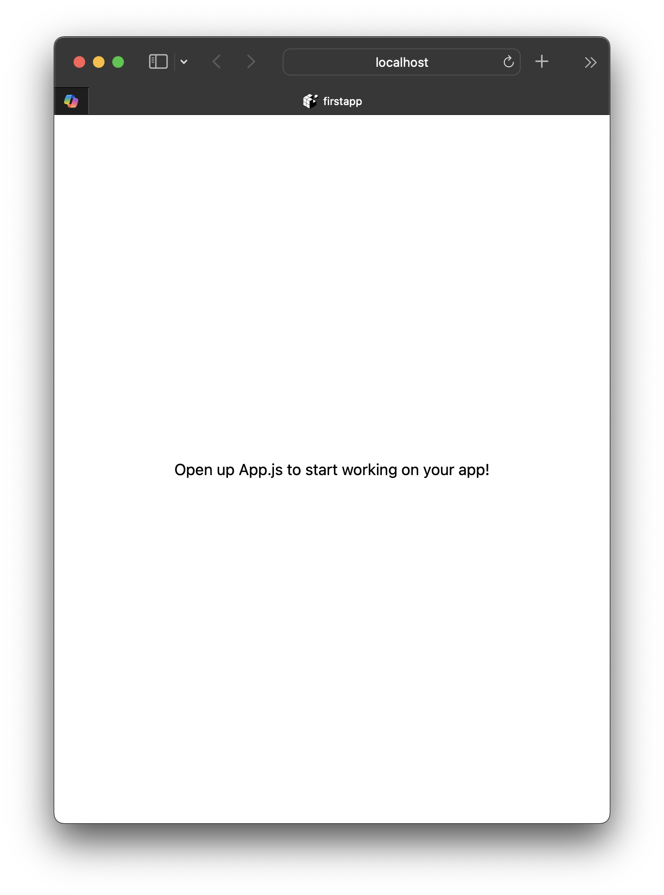

# React Native Lab Exercises 2
## Εργαστηριακές Ασκήσεις: Setup Περιβάλλοντος Ανάπτυξης

**Στόχος του εργαστηρίου**: Στο τέλος του εργαστηρίου πρέπει να έχετε στο laptop σας ένα λειτουργικό περιβάλλον ανάπτυξης:
- ✅ Node.js & NPM
- ✅ Expo (μέσω `npx expo`)
- ✅ Ένα πρώτο Expo project που τρέχει στον browser και ανανεώνεται αυτόματα όταν αλλάζετε τον κώδικα

Το ίδιο περιβάλλον θα χρησιμοποιηθεί σε όλα τα επόμενα εργαστήρια, οπότε βεβαιωθείτε ότι όλα τα βήματα του [Checklist](#checklist) λειτουργούν πριν φύγετε.

---

## Άσκηση 1: Εγκατάσταση Node.js & NPM

<div class="exercise">

**Στόχος**: Εγκατάσταση Node.js και verification του NPM

**Βήματα**:
```bash
# 1. Εγκατάσταση Node.js (LTS version)
### Official Installer (Προτεινόμενη)
### - Download από [nodejs.org](https://nodejs.org/)
### - Προτείνεται η **LTS version** (Long Term Support)


# 2. Verification (σε ΝΕΟ terminal μετά την εγκατάσταση)
node --version    # Πρέπει να δείτε: v22.13 ή νεότερο (προτείνεται v24 LTS)
npm --version     # Πρέπει να δείτε: 10.x.x ή νεότερο

# 3. Test Node.js REPL
node
> console.log("Hello from Node.js!")
> .exit

# 4. Test NPM
npm help
```

</div>

**Σημειώστε**: Τα version numbers που βλέπετε (θα σας χρειαστούν αν κάτι δεν λειτουργεί)

---

## Άσκηση 2: Node.js Basics & First Script

### Δημιουργία του πρώτου Node.js script:

```bash
# 1. Δημιουργία directory για το lab
mkdir ~/ReactNativeLab
cd ~/ReactNativeLab

# 2. Δημιουργία test script
cat > hello.js << 'EOF'
// hello.js - First Node.js script
console.log("Hello from Node.js!");
console.log("Current directory:", __dirname);
console.log("Node version:", process.version);

const sum = (a, b) => a + b;
console.log("Sum of 5 + 3 =", sum(5, 3));
EOF

# 3. Εκτέλεση
node hello.js
```

**Αναμενόμενο αποτέλεσμα**: Πρέπει να δείτε τα αντίστοιχα μηνύματα στο τερματικό σας

---

## Άσκηση 3: NPM Package Management

<div class="exercise">

**Στόχος**: Κατανόηση NPM και δημιουργία `package.json`

**Βήματα**:
```bash
# 1. Δημιουργία νέου project directory
mkdir ~/ReactNativeLab/npm-test
cd ~/ReactNativeLab/npm-test

# 2. Initialize NPM project
npm init -y

# 3. Εξέταση του package.json
cat package.json

# 4. Εγκατάσταση test package
##   N.B.: Από την έκδοση 5 το chalk είναι ES Module (export default) και
##         δεν δουλεύει όπως παρακάτω με require() — βλ. Άσκηση 3b.
##         Γι' αυτό ζητάμε συγκεκριμένα την έκδοση 4
npm install chalk@4

# 5. Δημιουργία script που χρησιμοποιεί το package
cat > app.js << 'EOF'
const chalk = require('chalk');
console.log(chalk.blue('Hello in blue!'));
console.log(chalk.red.bold('Error message in red!'));
EOF

# 6. Εκτέλεση
node app.js
```

</div>

---

## Άσκηση 3b: Modules - CommonJS vs ES Modules

<div class="exercise">

**Στόχος**: Δημιουργία δικών σας modules και κατανόηση των δύο module systems του Node.js

**Βήματα**:
```bash
cd ~/ReactNativeLab/npm-test

# 1. CommonJS (require / module.exports)
cat > math.js << 'EOF'
module.exports = {
  add: (a, b) => a + b,
  subtract: (a, b) => a - b
};
EOF

cat > calc.js << 'EOF'
const math = require('./math');
console.log('5 + 3 =', math.add(5, 3));
EOF

node calc.js

# 2. ES Modules (import / export) - αρχεία με κατάληξη .mjs
cat > math.mjs << 'EOF'
export const add = (a, b) => a + b;
export const subtract = (a, b) => a - b;
EOF

cat > calc.mjs << 'EOF'
import { add, subtract } from './math.mjs';
console.log('5 - 3 =', subtract(5, 3));
EOF

node calc.mjs

# 3. Νεότερη έκδοση του chalk (ES Module) με import
mkdir ~/ReactNativeLab/esm-test
cd ~/ReactNativeLab/esm-test
npm init -y
npm install chalk

cat > app.mjs << 'EOF'
import chalk from 'chalk';
console.log(chalk.green('Hello from an ES Module!'));
EOF

node app.mjs
```

</div>

**Ερωτήσεις**:
1. Δοκιμάστε στο `esm-test` ένα `app.js` με `const chalk = require('chalk')`. Τι error παίρνετε και γιατί;
2. Ποιο από τα δύο συστήματα χρησιμοποιεί το `App.js` του Expo project (Άσκηση 7);

<div class="tip">

Αντί για `.mjs`, μπορείτε να ορίσετε `"type": "module"` στο `package.json` — τότε όλα τα `.js` του project είναι ES Modules.

</div>

---

## Άσκηση 4: Κατανόηση package.json

### Ανατομία του package.json:
```json
{
  "name": "npm-test",           // Project name
  "version": "1.0.0",            // Semantic versioning
  "description": "",             // Project description
  "main": "index.js",            // Entry point
  "scripts": {                   // NPM scripts
    "test": "echo \"Error: no test specified\" && exit 1"
  },
  "keywords": [],                // Search keywords
  "author": "",                  // Your name
  "license": "ISC",              // License type
  "dependencies": {              // Production dependencies
    "chalk": "^4.1.2"
  }
}
```

<div class="tip">

**Versioning**: `^4.1.2` = Compatible με 4.x.x (όχι 5.0.0)  
**node_modules/**: Περιέχει downloaded packages (μην τα κάνετε commit σε repo)

</div>

**Μικρή άσκηση**: Προσθέστε στο `scripts` ένα `"start": "node app.js"` και τρέξτε `npm start`.

---

## Άσκηση 5: Δημιουργία πρώτου Expo project

<div class="exercise">

**Στόχος**: Δημιουργία πρώτου Expo project

<div class="tip">

Δεν χρειάζεται global εγκατάσταση του Expo (το παλιό `expo-cli` έχει καταργηθεί).
Το Expo CLI έρχεται μαζί με κάθε project και το καλούμε με `npx expo ...`

</div>

**Βήματα**:
```bash
# 1. Δημιουργία νέου Expo project
  ##   N.B.: Χρήση --template blank για απλό JavaScript project
  cd ~/ReactNativeLab
  npx create-expo-app@latest firstapp --template blank

# Creating an Expo project using the blank template.
# ✔ Downloaded and extracted project files.
# > npm install
#
# ✅ Your project is ready!
#
# To run your project, navigate to the directory and run one of the following npm commands.
#
# - cd firstapp
# - npm run android
# - npm run ios
# - npm run web

# 2. Είσοδος στο project
cd ~/ReactNativeLab/firstapp

# 3. Verification
npx expo --version

# 4. Εξέταση της δομής
ls -la
```

</div>

---

## Άσκηση 6: Θεωρία - Expo Project Structure

### Δομή του Expo Project:
```
firstapp/
├── .expo/                   # Τοπικά αρχεία του Expo (δημιουργείται στο 1ο start)
├── .git/                    # Το project είναι ήδη git repository!
├── assets/                  # Images (icon, splash, favicon, Android icons)
│   ├── icon.png
│   ├── splash-icon.png
│   └── ...
├── node_modules/            # NPM dependencies
├── App.js                   # >>> Main component <<<
├── app.json                 # App configuration
├── index.js                 # Registers App ως root component
├── AGENTS.md                # Οδηγίες για AI coding assistants
├── package.json             # Dependencies & scripts
└── package-lock.json        # Lock file for dependencies
```

**Κύρια αρχεία**:
- `App.js`: Το κύριο component της εφαρμογής
- `app.json`: Metadata (name, version, orientation, etc.)
- `package.json`: Scripts & dependencies

**Ερώτηση**: Ανοίξτε το `package.json`. Ποια scripts υπάρχουν; Ποιες εκδόσεις των `expo`, `react` και `react-native` χρησιμοποιούνται;

---

## Άσκηση 7: Εξέταση & Κατανόηση App.js

<div class="exercise">

**Στόχος**: Ανάλυση του default Expo App.js

**Βήματα**:
```bash
# 1. Άνοιγμα του App.js
cd ~/ReactNativeLab/firstapp
cat App.js
```

**Ερωτήσεις**:
1. Ποια components χρησιμοποιούνται; 
2. Πού ορίζεται το styling; 
3. Τι είναι το `export default`; 
4. Πώς το component επιστρέφει JSX; 

</div>

---

## Άσκηση 7b: Default App.js Ανάλυση

```jsx
import { StatusBar } from 'expo-status-bar';
import { StyleSheet, Text, View } from 'react-native';

export default function App() {
  return (
    <View style={styles.container}>
      <Text>Open up App.js to start working on your app!</Text>
      <StatusBar style="auto" />
    </View>
  );
}

const styles = StyleSheet.create({
  container: {
    flex: 1,
    backgroundColor: '#fff',
    alignItems: 'center',
    justifyContent: 'center',
  },
});
```

**Ανάλυση components**:
- `View`: Container (like `<div>` στο HTML)
- `Text`: Text element (όλο το text πρέπει να είναι σε `<Text>`)
- `StyleSheet.create()`: Performance-optimized styles

---

## Άσκηση 8: Εκτέλεση της Εφαρμογής

<div class="exercise">

**Στόχος**: Εκτέλεση της εφαρμογής σε browser (Expo web)

**Βήματα**:
```bash
# 1. Εκκίνηση Expo development server
cd ~/ReactNativeLab/firstapp
npm start

# ή
npx expo start

# 2. Στο menu που εμφανίζεται στο terminal:
#    Πατήστε 'w' για web browser
#    (αν σας ζητηθεί να εγκαταστήσετε react-dom / react-native-web, απαντήστε Yes,
#     ή τρέξτε: npx expo install react-dom react-native-web)

# 3. Θα ανοίξει browser window αυτόματα
#    URL: http://localhost:8081

# 4. Παρατηρήστε:
#    - Το κείμενο "Open up App.js to start working..."
#    - Το layout (centered)
#    - Development tools στο browser
```

</div>

**Αναμενόμενο αποτέλεσμα**:



---

## Άσκηση 8b: Expo Dev Tools

### Όταν τρέξετε `npx expo start`, βλέπετε:

```
Starting Metro Bundler

› Metro waiting on exp://192.168.1.x:8081
› Scan the QR code above with Expo Go (Android) or the Camera app (iOS)

› Web is waiting on http://localhost:8081

› Press a │ open Android
› Press i │ open iOS simulator
› Press w │ open web

› Press r │ reload app
› Press m │ toggle menu
› Press j │ open debugger
```

**Browser Dev Tools** (F12 / Cmd+Option+I στον browser):
- 🧱 Elements: πώς τα `View`/`Text` γίνονται HTML elements
- 📊 Console: logs & errors από το `console.log()`
- 🌐 Network: τι κατεβάζει ο browser από τον Metro bundler

**Δοκιμάστε**: Προσθέστε ένα `console.log('App rendered');` μέσα στη function `App` και βρείτε το μήνυμα στο Console του browser **και** στο terminal.

---

## Άσκηση 9: Τροποποίηση της Εφαρμογής

<div class="exercise">

**Στόχος**: Αλλαγή του default App.js και παρατήρηση hot reloading

**Βήματα**:
```bash
# 1. Άνοιγμα του App.js σε editor
code App.js  # ή χρησιμοποιήστε άλλο editor

# 2. Αλλάξτε το Text σε:
<Text style={styles.title}>Καλώς ήρθατε στο React Native!</Text>
<Text style={styles.subtitle}>Mobile App Development Lab</Text>

# 3. Προσθέστε styles για το title και subtitle:
title: {
  fontSize: 24,
  fontWeight: 'bold',
  color: '#2c3e50',
  marginBottom: 10,
},
subtitle: {
  fontSize: 16,
  color: '#7f8c8d',
},

# 4. Αποθήκευση (Cmd+S / Ctrl+S)
# 5. Παρατηρήστε το automatic reload στο browser
```

</div>

---

## Άσκηση 9b: Complete Modified Code

```jsx
import { StatusBar } from 'expo-status-bar';
import { StyleSheet, Text, View } from 'react-native';

export default function App() {
  return (
    <View style={styles.container}>
      <Text style={styles.title}>Καλώς ήρθατε στο React Native!</Text>
      <Text style={styles.subtitle}>Mobile App Development Lab</Text>
      <StatusBar style="auto" />
    </View>
  );
}

const styles = StyleSheet.create({
  container: {
    flex: 1,
    backgroundColor: '#ecf0f1',
    alignItems: 'center',
    justifyContent: 'center',
  },
  title: {
    fontSize: 24,
    fontWeight: 'bold',
    color: '#2c3e50',
    marginBottom: 10,
  },
  subtitle: {
    fontSize: 16,
    color: '#7f8c8d',
  },
});
```

**Πειραματιστείτε** (με τον server να τρέχει):
1. Αλλάξτε το `backgroundColor` του `container` — ενημερώνεται αμέσως ο browser;
2. Βάλτε σκόπιμα ένα συντακτικό λάθος (π.χ. σβήστε ένα `>`) και αποθηκεύστε. Τι εμφανίζεται στον browser και τι στο terminal; Διορθώστε το.
3. Σταματήστε τον server (`Ctrl+C`) και ξεκινήστε τον ξανά. Θα χρειαστεί να το κάνετε συχνά!

---

## Common Troubleshooting Issues

### Issue 1: "command not found: node" / "npm"
- Κλείστε και ανοίξτε ξανά το terminal μετά την εγκατάσταση
- Windows: βεβαιωθείτε ότι ο installer πρόσθεσε το Node.js στο `PATH`

### Issue 2: "command not found: expo"
```bash
# Solution: Χρησιμοποιήστε npx μέσα στο project directory
cd ~/ReactNativeLab/firstapp
npx expo start
```

### Issue 3: `TypeError: chalk.blue is not a function` (ή `ERR_REQUIRE_ESM` σε παλαιότερο Node)
```bash
# Αιτία: εγκαταστάθηκε νεότερο chalk (ES Module) και το φορτώνετε με require()
# Solution: εγκαταστήστε την έκδοση 4 (βλ. Άσκηση 3)
npm install chalk@4
# ή χρησιμοποιήστε import σε αρχείο .mjs (βλ. Άσκηση 3b)
```

### Issue 4: Metro bundler fails to start / "Unable to resolve module"
```bash
# Solution:
rm -rf node_modules package-lock.json
npm install
npx expo start --clear
```

### Issue 5: Port 8081 already in use
- Κάποιος άλλος Expo server τρέχει ήδη — κλείστε τον (`Ctrl+C` στο άλλο terminal)
- ή δεχτείτε τη χρήση άλλου port όταν σας ρωτήσει το Expo

### Issue 6: Hot reload not working
```bash
# Solution:
# Press 'r' in terminal to reload manually
# ή
npx expo start --clear
```

---

## Checklist

**Περιβάλλον**:
- [ ] `node --version` και `npm --version` δουλεύουν
- [ ] Το `hello.js` και το `app.js` (chalk) τρέχουν
- [ ] Το project `~/ReactNativeLab/firstapp` δημιουργήθηκε
- [ ] `npx expo start` ξεκινά χωρίς errors

**Browser Testing**:
- [ ] App loads without errors (πλήκτρο `w`)
- [ ] All text displays correctly (Greek characters)
- [ ] Hot reload works (αλλαγή στο `App.js` → άμεση ενημέρωση)
- [ ] Βλέπετε τα `console.log()` στο browser console

➡️ Στο **Lab 03** θα συνεχίσουμε στο ίδιο project (`firstapp`) προσθέτοντας interactivity (state, buttons, input) και θα τρέξουμε την εφαρμογή στο κινητό με το Expo Go.

---
